

<h1 align="center">Autyism's Litematica Enhancement</h1>

Practical quality-of-life additions for building with Litematica.

Autyism's Litematica Enhancement（ALE）：让 Litematica 投影用起来更顺手的一组实用改进。

<a href="#english">English</a> · <a href="#简体中文">简体中文</a>

  

# English

Autyism's Litematica Enhancement (ALE) is a client-side add-on for [Litematica](https://modrinth.com/mod/litematica) and [MaLiLib](https://modrinth.com/mod/malilib). It does not replace Litematica. It adds the small things you miss when you build from schematics every day: a real block picker for block lists, a way to save your schematic edits, clearer error markers, and checks for entities and container contents.

All features except the scrollable button rows can be turned off in ALE's settings. ALE never writes to your schematic files unless you click **Save edits** or **Save as...**.

## Features

### Block lists

- **Pick blocks / Pick items button.** Block lists in Litematica and other MaLiLib-based mods (for example Litematica's `ignorableExistingBlocks` or the printer's block lists) get a **Pick blocks...** button, and item lists get **Pick items...**. No more typing block IDs by hand.
- **Searchable picker.** Your current list is on the left, every block with its icon and name is on the right, and you can search by name (in your game language) or by ID. Click a block to add it, click − to remove it.

### Saving schematic edits

- **Save edits.** A new button in the placement configuration screen writes the schematic as it is now, including **Replace** in the material list and changes made in Litematica's Edit Schematic mode, back to the placement's `.litematic` file, so your edits survive a restart. While there are unsaved changes, the button reads **Save edits\***.
- **Save as...** Saves the edited schematic as a new file next to the original (the suggested name ends in `_edited`) and leaves the original untouched.
- **Sign wood replacement that keeps your signs.** When you replace a sign's wood with **Replace** in the material list, every form of that sign (standing and wall, or hanging and wall hanging) becomes the matching form of the new wood. Rotation, facing, waterlogging and the text on both sides are kept.

### Spotting mistakes in the world

- **Blue "W": only waterlogging is wrong.** When a placed block is correct except for being waterlogged (or not), a blue W is drawn on all six faces, on top of Litematica's wrong-state overlay. You can see at once that the block only needs water, or must not have any.
- **Red "D": wrong orientation.** When it is the right block but turned the wrong way, a red D is drawn on all six faces. This covers facing, axis, rotation, rail shape, floor/wall/ceiling attachment, door hinge side, top/bottom half and crafter orientation; if both letters would apply, D is shown.
- **Render Through Glass.** Litematica's overlays and translucent ghost blocks normally disappear behind glass. With ALE they stay visible behind glass and stained glass, which helps when you build windows or greenhouses.
- **Translucent schematic entities.** Item frames, armor stands, minecarts, boats and other entities of a schematic are drawn see-through with a light ghost tint, so you can't mistake them for real ones. With Litematica's `renderBlocksAsTranslucent` option turned on, block entities such as chests, signs, beds and shulker boxes turn see-through as well.
- **Entity info overlay.** Hold Litematica's info overlay key (`I`) and look at a schematic entity to get a Schematic / World comparison: facing, item and item rotation for item frames, rotation and equipment for armor stands, facing and variant for paintings. The title is green when everything matches, yellow when something differs (the different lines are highlighted) and red when the entity is missing in the world.
- **Fluid info overlay.** The same key also works on water and lava in the schematic and shows Litematica's usual block info for them.

### Schematic browser

- **Layouts with 3D thumbnails.** A small button at the top-left of Litematica's schematic browser switches between the plain list, a list with previews (taller rows with a 3D thumbnail of each schematic) and grids with 5, 4 or 3 tiles per row. Thumbnails are built in the background for the entries on screen, so folders with hundreds of files stay smooth. Schematics larger than the size limit (125,000 blocks by default) show "Too large" instead, unreadable files show "Can't read". ALE remembers the layout; the gaps and row heights can be changed in its settings.
- **3D preview of the selected schematic.** Below the schematic's information on the right, ALE draws the whole schematic in 3D: real block models with lighting, all regions, water and glass, and block entities such as chests, signs, banners and beds. Drag with the left mouse button to turn it and use the mouse wheel to move closer or further away. Very large schematics are built piece by piece from the middle outwards and stop at about two million faces, so the game never freezes.
- **Full screen and free camera.** Two small buttons under the information open the preview full screen (Esc goes back and keeps the view) and switch on a free camera: fly with your movement keys and drag to look around. Switching the free camera off goes back to the starting view.
- **Icons for folders and schematics.** Right-click the icon of a folder or schematic to give it an item as icon, for example a redstone block for your redstone builds. Choose whether the item replaces the small folder symbol, is shown large, or a schematic inside the folder is previewed. The icons are stored in ALE's settings file, not in your schematic folders.

### Material lists and verification

- **Replace.** Every row of the material list gets a **Replace** button next to **Ignore**. Pick another block in the searchable grid and every block of that material in the schematic (all regions) is swapped for it. Facing, half, waterlogging and the other states both blocks have are kept; signs, torches, banners and heads keep their standing or wall form, and signs keep their text. The material list and the schematic in the world update right away, and **Save edits** keeps the change.
- **Entities in material lists.** Item frames, armor stands, minecarts, boats, paintings and other entities that are placed with an item are counted in Litematica's material lists next to the blocks. In a placement's list, entities that already exist in the world are not counted as missing.
- **Contents list.** A **Contents** button in the material list opens a separate list of everything stored in the schematic: items in chests, barrels, shulker boxes, hoppers and other containers, in item frames, on armor stands and in container minecarts. Shulker boxes inside containers are opened up and their contents counted too.
- **Container check in the Schematic Verifier.** The verifier also compares the items in each container with the schematic (slot order does not matter). Containers that differ get a magenta outline and a message tells you how many there are; once a container is fixed, its outline disappears.

### Litematica screens

- **Scrollable button rows.** When a row of buttons in a Litematica screen does not fit, for example after ALE or another mod adds buttons, you can scroll it with the mouse wheel or the ◀ ▶ arrows instead of the buttons overlapping. Buttons that would cover text or an input box move to the bottom row, and rows that fit stay as they are.

## Screenshots

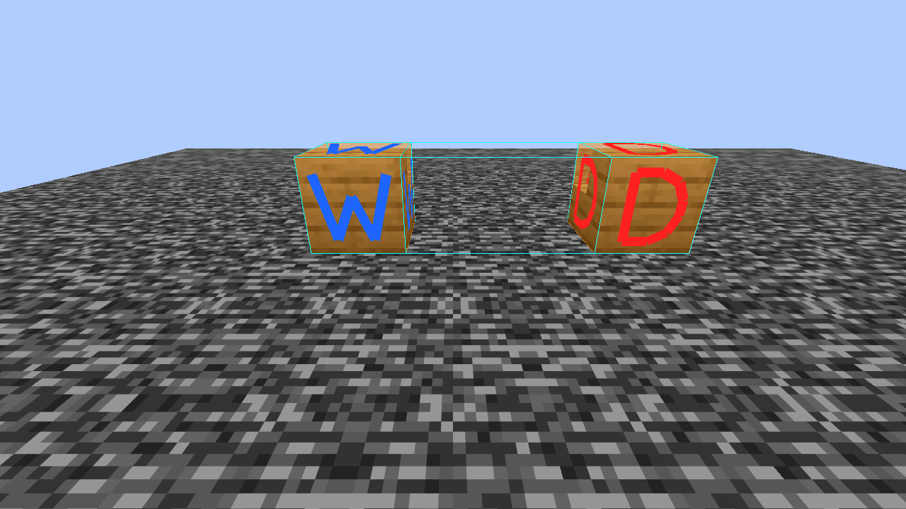

*Blue W: only waterlogging differs. Red D: the right block, turned the wrong way.*

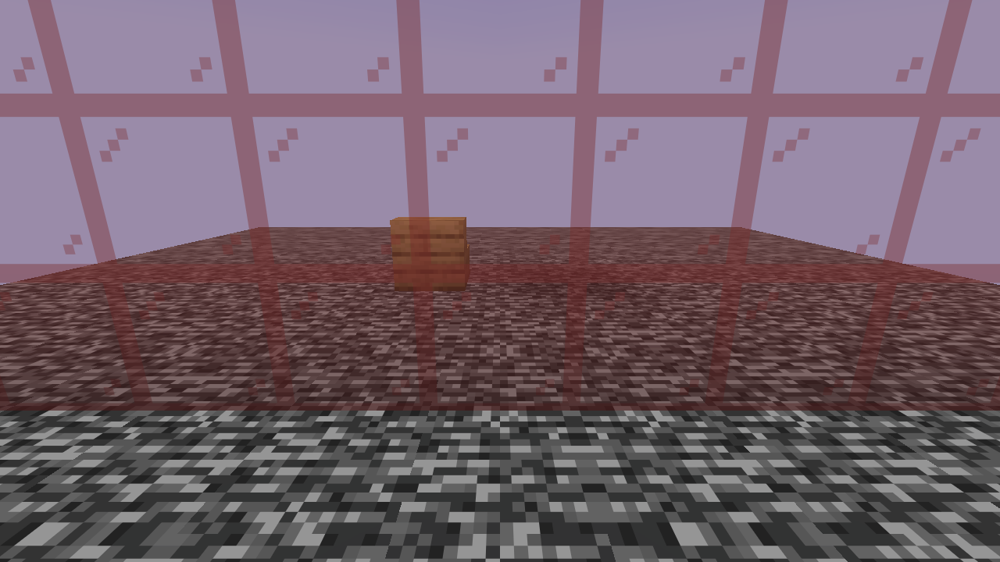

*Render Through Glass off: Litematica's markers are hidden behind stained glass.*

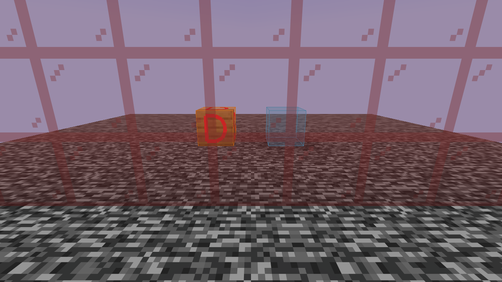

*Render Through Glass on: the same view, with the wrong-orientation stairs (D) and the missing block visible.*

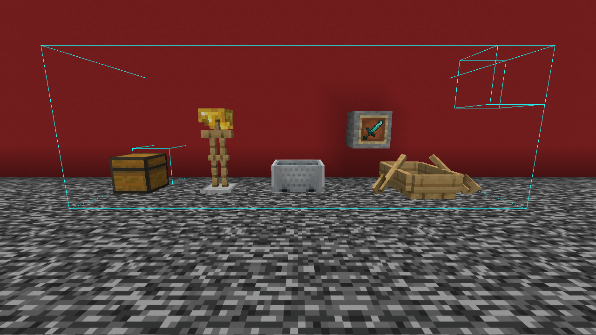

*Without Translucent Schematic Entities: the schematic's armor stand, minecart, boat and item frame look like real ones.*

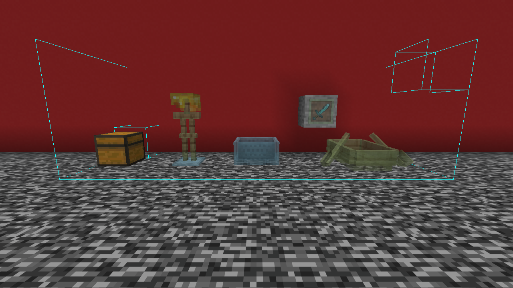

*With Translucent Schematic Entities: see-through with a ghost tint, while the real chest stays solid.*

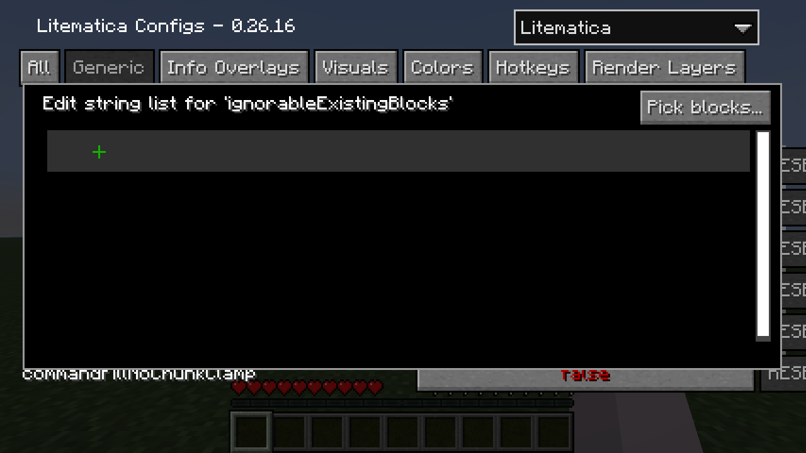

*The new Pick blocks... button in one of Litematica's block lists.*

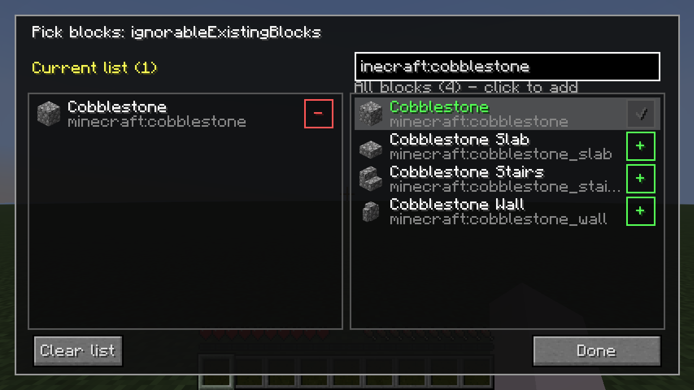

*The picker: current list on the left, all blocks on the right, searchable by name or ID.*

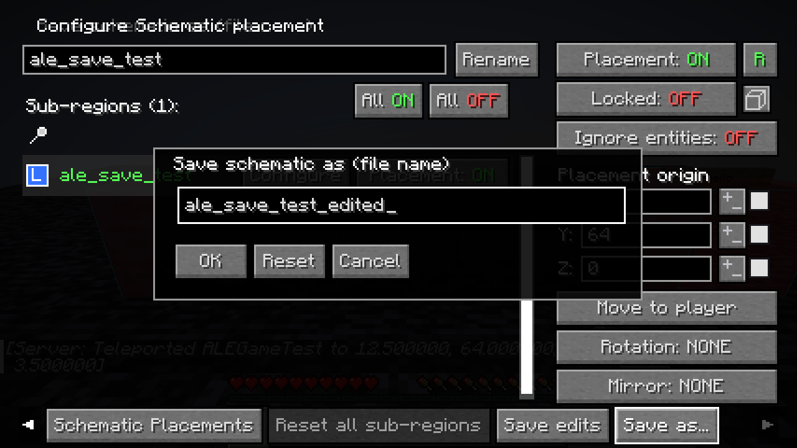

*Save as: the edited placement is written to a new schematic file.*

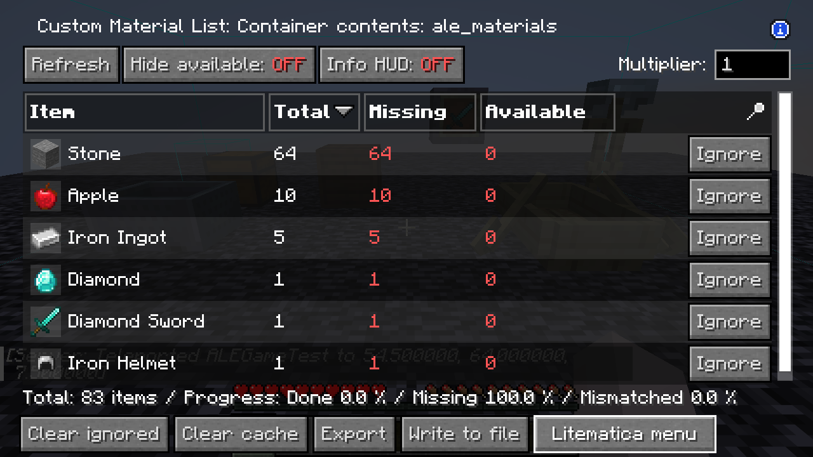

*Contents: a material list of everything the schematic's containers should hold.*

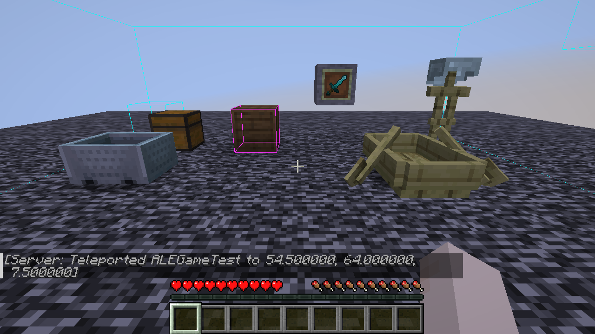

*The Schematic Verifier marks a container whose contents differ from the schematic.*

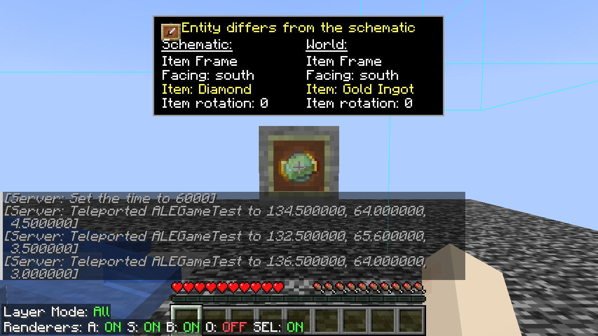

*The info overlay compares a schematic entity with the one in the world.*

## How to use

ALE has one hotkey of its own, **Open ALE Settings**, which is not bound by default (set it in ALE's settings). Everything else lives in Litematica's screens and uses Litematica's keys. These are Litematica's default keys:

| Action | Default key | Where to change it |
|---|---|---|
| Show the info overlay (entity comparison, fluid info) | Hold `I` | Litematica settings → Hotkeys → `renderInfoOverlay` |
| Open Litematica's main menu (Schematic Placements → Configure has the save buttons) | `M` | Litematica settings → Hotkeys → `openGuiMainMenu` |
| Open the material list of the selected placement | `M` + `L` | Litematica settings → Hotkeys → `openGuiMaterialList` |
| Open the Schematic Verifier of the selected placement | `M` + `V` | Litematica settings → Hotkeys → `openGuiSchematicVerifier` |
| Open Litematica's settings | `M` + `C` | Litematica settings → Hotkeys → `openGuiSettings` |

`M` + `C` means: hold M, then press C.

**Opening ALE's settings**

- With Mod Menu: Mods → Autyism's Litematica Enhancement → settings button.
- Without Mod Menu: open Litematica's settings (`M` + `C`) and pick **Autyism's Litematica Enhancement** in the drop-down list in the top-right corner. Most other MaLiLib-based mods have the same list in their settings screens.
- The settings are stored in `config/autyism-le.json`.

**Pick blocks for a list**

1. Open the settings of Litematica (or another MaLiLib-based mod) and click a block list to edit it, for example `ignorableExistingBlocks` on the Visuals tab.
2. Click **Pick blocks...** in the top-right corner of the list editor.
3. Type part of a name or ID into the search box. Click a block on the right to add it (added blocks turn green with a check mark), or click − on the left to remove one. Shift-click **Clear list** to empty the whole list.
4. Click **Done**. The list editor now shows the new entries.

**Keep your schematic edits**

1. Change the schematic, for example with **Replace** in the material list or with Litematica's Edit Schematic mode.
2. Open Litematica's main menu (`M`) → **Schematic Placements** → **Configure** next to your placement.
3. Click **Save edits** to overwrite the file, or **Save as...** to save a copy under a new name. To overwrite an existing file with Save as..., hold Shift when you confirm.
4. If you can't see the buttons, scroll the bottom button row with the mouse wheel or click ▶.

**Check entities and fluids**

1. Look at an entity, or at water or lava, of the schematic.
2. Hold `I`. Green means it matches, yellow means something differs, red means the entity is missing in the world.

**Check container contents**

1. Open the Schematic Verifier (`M` + `V`) and click **Start verification**.
2. When it finishes, containers whose contents differ get a magenta outline and a message tells you how many there are.
3. Fix the contents. The outline goes away on its own shortly afterwards.

**Gather entities and container items**

1. Open the material list (`M` + `L`). Entities are listed together with the blocks.
2. Click **Contents** in the bottom button row to see every item stored inside the schematic.

**Browse schematics with previews**

1. Open Litematica's main menu (`M`) and click **Load Schematics**.
2. Click the small button at the top-left of the list to switch the layout.
3. Click a schematic: its 3D preview appears under the information on the right. Drag to turn it, scroll to zoom, and use the two small buttons for full screen and the free camera.

**Give a folder an icon**

1. Hover the icon of a folder (in the list with previews it is the small folder symbol) and right-click it.
2. Type an item ID or click **Pick...**, choose where the icon goes and click **OK**. **Default** removes the icon again.

**Replace a material**

1. Open the material list (`M` + `L`) and click **Replace** in the row of the material.
2. Search for the new block, click it and click **OK**. A message tells you how many blocks were replaced.
3. Use **Save edits** (Schematic Placements → Configure) if you want to keep the change.

**Change the wood of signs**

1. In the material list, click **Replace** next to a sign.
2. Choose a sign of another wood and confirm. A message shows how many signs were changed.
3. Use **Save edits** if you want to keep the change.

## Settings

| Option (as shown in game) | Default | What it does |
|---|---|---|
| Block Picker For Block Lists | ON | Adds **Pick blocks...** / **Pick items...** to block and item list editors. |
| Save Edit Buttons | ON | Adds **Save edits** and **Save as...** to the placement configuration screen. |
| Info Overlay: Fluids & Entities | ON | The info overlay also compares schematic entities and shows info for schematic fluids. |
| Translucent Schematic Entities | ON | Draws schematic entities see-through with a ghost tint. |
| Waterlogged-Only Marker | ON | Blue W on blocks that only differ in waterlogging. |
| Waterlogged Marker Color | `#FF1E64FF` (blue) | Colour of the W. |
| Wrong Orientation Marker | ON | Red D on the right block turned the wrong way. |
| Orientation Marker Color | `#FFFF2020` (red) | Colour of the D. |
| Material List: Entities & Contents | ON | Counts entities in material lists and adds the **Contents** button. |
| Verifier: Container Contents | ON | The Schematic Verifier also checks what is inside containers. |
| Sign Wood Replace Fix | ON | Replacing sign wood with Schematic Preview's **Replace** keeps each sign's form, facing, waterlogging and text (ALE's own **Replace** always does). |
| Render Through Glass | ON | Keeps schematic overlays and translucent ghost blocks visible behind glass and stained glass. |
| Schematic Browser Previews | ON | Browser layouts, thumbnails, the 3D preview and the icons. |
| Material List: Replace | ON | The **Replace** button in material lists. |
| Open ALE Settings | not bound | Hotkey that opens these settings. |

The **Schematic browser** tab holds Browser Layout (List), Horizontal Gap (2), Vertical Gap (2), List Row Height (15), Preview List Row Height (35), Tile Height Ratio (1.0) and Thumbnail Size Limit (125000 blocks). The **3D preview** tab holds Block Entities In Previews (ON), Preview Field Of View (50), Preview Start Yaw (-45) and Preview Start Pitch (30).

Colours use the `#AARRGGBB` format.

A few Litematica options affect ALE's features: the W and D markers are drawn on Litematica's wrong-state overlay (`enableSchematicOverlay` and `schematicOverlayTypeWrongState` must be on), the entity info needs `blockInfoOverlayEnabled`, and the transparency of schematic entities follows `ghostBlockAlpha`.

## Requirements

There is a separate jar for each Minecraft version:

| Minecraft | Jar | Java | Fabric Loader | MaLiLib | Litematica |
|---|---|---|---|---|---|
| 1.21.11 | `autyism-litematica-enhancement-1.0.0.jar` | 21 or newer | 0.17.0 or newer | 0.27.0 or newer | 0.26.0 or newer |
| 26.1, 26.1.1, 26.1.2 | `autyism-litematica-enhancement-1.0.0+26.1.2.jar` | 25 or newer | 0.19.3 or newer | 0.28.12 or newer | 0.27.14 or newer |
| 26.2 | `autyism-litematica-enhancement-1.0.0+26.2.jar` | 25 or newer | 0.19.3 or newer | 0.29.6 or newer | 0.28.8 or newer |
| 26.3 | `autyism-litematica-enhancement-1.0.0+26.3.jar` | 25 or newer | 0.19.3 or newer | 0.30.2 or newer | 0.29.1 or newer |

Fabric API, MaLiLib and Litematica are required, each in the build for your Minecraft version.

| Optional | |
|---|---|
| Mod Menu | adds a settings button to the mod list |
| Schematic Preview | not needed; when it is installed, ALE leaves the browser previews, icons and **Replace** to it |
| Litematica Printer Autyism Edition | its block lists get the picker too |

ALE is client-side only. Nothing needs to be installed on the server.

## Compatibility

- **Sodium and Iris:** ALE's rendering features were tested with Sodium and Iris installed on 1.21.11, and with Sodium on 26.1.2.
- **Other rendering mods:** Render Through Glass changes when Litematica draws its see-through parts. If another mod changes world rendering so that this is not possible, ALE falls back to Litematica's normal drawing and only the see-through-glass effect is lost.
- **Schematic Preview:** optional. When it is installed, ALE turns its own browser previews, folder icons and **Replace** off and Schematic Preview provides them; ALE still keeps signs intact when you replace sign wood with its **Replace**.
- **Litematica Printer Autyism Edition:** optional and independent; neither mod needs the other. With both installed, the printer's block lists get the picker.
- **Other MaLiLib-based mods:** their block and item lists get the picker when ALE recognizes them (by the list's name or its current entries).
- **Mods that add buttons to Litematica screens:** crowded rows become scrollable, so all buttons stay reachable.
- **Litematica versions:** ALE changes how parts of Litematica work, so it depends on Litematica's internals. It was built and tested with Litematica 0.26.16 and MaLiLib 0.27.20 on 1.21.11, Litematica 0.27.14 and MaLiLib 0.28.12 on 26.1.2, Litematica 0.28.8 and MaLiLib 0.29.6 on 26.2, and Litematica 0.29.1 and MaLiLib 0.30.2 on 26.3; a future Litematica update may need a matching ALE update.
- No incompatibilities are known at the time of release.

## Installation

1. Install Fabric Loader for your Minecraft version (see the table above for the versions and Java you need).
2. Put Fabric API, MaLiLib and Litematica for that Minecraft version into your `mods` folder.
3. Download the ALE jar for your Minecraft version and put it into the `mods` folder too.
4. Optional: add Mod Menu.
5. Start the game.

## FAQ

**Do I need ALE on the server?**
No. ALE runs only on your client and works without anything on the server (see Known limitations for the container check on servers).

**Does ALE need the printer, or the printer ALE?**
No. ALE and Litematica Printer Autyism Edition are separate mods and each works on its own.

**Where is the Save edits button?**
At the end of the bottom button row in the placement configuration screen (Schematic Placements → Configure). If the row is too long, scroll it with the mouse wheel or click ▶. Also check that Save Edit Buttons is on.

**The W or D markers don't show up.**
They are drawn on Litematica's wrong-state overlay, so they only appear on blocks Litematica marks as "wrong state", and only when Litematica's `enableSchematicOverlay` and `schematicOverlayTypeWrongState` options are on.

**Does ALE change my schematic files on its own?**
No. ALE only writes to a schematic file when you click **Save edits** or **Save as...**. Save edits writes a temporary file first and then replaces the original, and both buttons remove leftover data of replaced blocks, for example the contents of a chest that was replaced by stone.

**Does ALE slow the game down?**
The screen features only run while a screen is open, the info overlay only while you hold its key, and the markers are built together with Litematica's own overlay. In testing, frame rates were the same with ALE on and off.

## Known limitations

- The picker adds plain block or item IDs. Block tags such as `#minecraft:wooden_slabs` still have to be typed in the normal list editor; entries the picker doesn't recognize are shown as they are and can still be removed.
- The picker search matches names in your current game language and IDs; there is no fuzzy or pinyin search.
- Lists are recognized by their name and current entries, so an unusual list may not get the picker button.
- **Save edits** can only overwrite `.litematic` files. A placement without a file, or one loaded from another format, needs **Save as...**.
- With Schematic Preview's **Replace**, the sign fix only applies when a sign is replaced with another sign.
- The 3D previews show blocks and block entities, not entities such as item frames or armor stands.
- Very large schematics are shown only partly in the 3D preview (about two million faces); thumbnails skip schematics over the size limit.
- The previews were tested with Sodium and Iris without a shader pack; with a shader pack active they may look different.
- Material lists only count entities that are placed with an item; mobs are not counted.
- Entities are matched by type and position, not by identity.
- The container check only looks at containers whose block already matches the schematic exactly. On multiplayer servers ALE can only read container contents when Litematica receives block entity data (Litematica's entity data sync, for example with Servux on the server); otherwise those containers are not checked. The container check was verified in single player.

## Credits

- **masa** and **Sakura-Ryoko** for Litematica and MaLiLib, which ALE builds on.
- The schematic browser layouts and 3D previews, the folder icons and the material list's **Replace** follow DimasKama's [Schematic Preview](https://modrinth.com/mod/schematicpreview). If you prefer the original, install it: ALE then leaves these features to it.
- The layout of the block picker is inspired by the block list setting in Meteor Client.

Made by **Autyism**. Source code and bug reports: [GitHub](https://github.com/Autyism/autyism-le) · [Issues](https://github.com/Autyism/autyism-le/issues)

## License

**AGPL-3.0-only**: ALE is free software under the GNU Affero General Public License v3.0; see [LICENSE.md](LICENSE.md).

# 简体中文

**Autyism 的投影增强**

Autyism 的投影增强（Autyism's Litematica Enhancement，简称 ALE）是 [Litematica](https://modrinth.com/mod/litematica) 和 [MaLiLib](https://modrinth.com/mod/malilib) 的客户端附属模组。它不替代 Litematica，而是补上平时用投影建造时缺的那些小功能：方块列表的方块选择界面、保存对投影的修改、更清楚的错误标记，以及实体和容器内容物的检查。

除了“按钮行可滚动”，所有功能都可以在 ALE 的设置里关闭。只有在你点击“保存修改”或“另存为…”时，ALE 才会写入投影文件。

## 功能

### 方块列表

- **“选择方块…” / “选择物品…”按钮**：Litematica 和其他 MaLiLib 系模组里的方块列表（例如 Litematica 的“可忽略的现有方块”、打印机的各种方块列表）会多一个“选择方块…”按钮，物品列表则是“选择物品…”。不用再手打方块 ID。
- **可搜索的选择界面**：左边是当前列表，右边是带图标和名称的全部方块，可以按名称（游戏当前语言）或 ID 搜索。点一下方块就加入列表，点 − 移除。

### 保存投影修改

- **保存修改**：投影放置的配置界面多了这个按钮，可以把当前的投影（包括材料列表里“替换”的材料和 Litematica“编辑原理图”模式做的修改）写回这个放置对应的 `.litematic` 文件，重启游戏后也不会丢。有未保存的修改时，按钮显示为“保存修改*”。
- **另存为…**：把修改后的投影另存为新文件，放在原文件旁边（默认文件名末尾加 `_edited`），原文件保持不变。
- **替换告示牌木材时保留告示牌**：在材料列表里用“替换”更换告示牌的木材时，这种告示牌的所有形态（立式和挂墙，或者悬挂和挂墙悬挂）都会换成新木材的对应形态，旋转、朝向、含水状态和正反两面的文字都会保留。

### 在世界里看出问题

- **蓝色“W”：只差含水**：放好的方块其他都对、只是含水状态和投影不同时，会在 Litematica 的“错误状态”覆盖层上，在方块六个面各画一个蓝色的 W，一眼就能看出这个方块只是需要（或者不该）含水。
- **红色“D”：朝向错误**：方块对了但方向不对时，六个面各画一个红色的 D。包括朝向、轴向、旋转角度、铁轨方向、贴地/贴墙/贴天花板、门轴左右、上半/下半以及合成器的朝向；两种情况同时存在时显示 D。
- **透过玻璃显示投影**：原本 Litematica 的覆盖层和半透明投影方块在玻璃后面会看不见。开启后，隔着玻璃和染色玻璃也能正常看到，做窗户、温室时很方便。
- **投影实体半透明**：投影里的物品展示框、盔甲架、矿车、船等实体会渲染成带幽灵色调的半透明效果，不会和真实实体搞混。开启 Litematica 的“渲染 - 方块半透明化”后，箱子、告示牌、床、潜影盒等方块实体也会一起变成半透明。
- **实体信息显示**：按住 Litematica 的信息显示键（`I`）看向投影里的实体，会显示“投影 / 世界”对比：物品展示框的朝向、物品和物品旋转，盔甲架的角度和装备，画的朝向和图案。全部一致时标题为绿色，有不同时为黄色（不同的行会标出来），世界里没有这个实体时为红色。
- **流体信息显示**：同一个键看向投影里的水和岩浆时，也会显示 Litematica 普通的方块信息。

### 投影浏览器

- **带 3D 缩略图的显示方式**：Litematica 投影浏览器左上角有一个小按钮，可以在普通列表、带预览的列表（行更高，每个投影前面有 3D 缩略图）和每行 5 / 4 / 3 个的网格之间切换。缩略图只为屏幕上看得到的条目在后台生成，几百个文件的文件夹也能流畅浏览。超过体积上限（默认 125000 个方块）的投影显示“太大”，读不出来的文件显示“无法读取”。ALE 会记住显示方式，间距和行高可以在设置里调整。
- **选中投影的 3D 预览**：右边投影信息的下面会画出整个投影的 3D 预览：真实的方块模型和光照、所有区域、水和玻璃，以及箱子、告示牌、旗帜、床等方块实体。按住左键拖动可以转动，滚轮可以拉近拉远。很大的投影会从中间向外一块一块生成，大约两百万个面之后停止，游戏不会卡住。
- **全屏和自由视角**：信息下面有两个小按钮：一个打开全屏预览（按 Esc 返回，视角保持不变），一个开启自由视角：用移动键飞行，拖动鼠标转视角。关掉自由视角后回到初始视角。
- **文件夹和投影的图标**：右键文件夹（或投影）的图标，可以给它换一个物品图标，比如给红石作品的文件夹用红石块。可以选择物品代替小的文件夹标记、显示成大图标，或者显示文件夹里一个投影的预览。图标保存在 ALE 自己的设置文件里，不会往你的投影文件夹里写东西。

### 材料列表与验证

- **替换**：材料列表每一行的“忽略”旁边多了一个“替换”按钮。在可搜索的方块网格里选一个方块，投影（所有区域）里这种材料的方块就会全部换成它。两种方块都有的朝向、上下半、含水等状态保持不变；告示牌、火把、旗帜、头颅保持立式或挂墙的形态，告示牌保留文字。材料列表和世界里的投影会马上更新，想保留这个修改就用“保存修改”。
- **材料列表统计实体**：物品展示框、盔甲架、矿车、船、画等需要用物品放置的实体，会和方块一起计入 Litematica 的材料列表。在投影放置的材料列表里，世界中已经存在的实体不算缺失。
- **容器内容物列表**：材料列表里的“容器内容物”按钮会打开一个单独的列表，列出投影里存放的所有物品：箱子、木桶、潜影盒、漏斗等容器里的物品，物品展示框里的物品，盔甲架的装备，以及运输矿车里的东西。容器里的潜影盒也会展开，统计它装的东西。
- **验证器检查容器内容物**：Litematica 的投影验证器（界面里叫“原理图验证器”）还会比较每个容器里的物品是否和投影一致（不看格子顺序）。不一致的容器会用洋红色框标出，并提示有几个；补好之后框会自动消失。

### Litematica 界面

- **按钮行可滚动**：Litematica 界面里一行按钮放不下时（例如 ALE 或其他模组加了按钮），可以用鼠标滚轮或两端的 ◀ ▶ 箭头左右滚动，按钮不再互相重叠。会盖住文字或输入框的按钮会移到最下面一行，放得下的行保持原样。

## 截图

*蓝色 W：只差含水；红色 D：方块对了，但朝向错误。*

*关闭“透过玻璃显示投影”：染色玻璃后面的投影标记看不见。*

*开启后的同一视角：朝向错误的楼梯（D）和缺失的方块都能看到。*

*关闭“投影实体半透明”：投影里的盔甲架、矿车、船和物品展示框看起来和真实实体一样。*

*开启“投影实体半透明”：实体变成带幽灵色调的半透明效果，真实的箱子仍然是实心的。*

*Litematica 方块列表里新增的“Pick blocks...”按钮（中文界面显示为“选择方块…”）。*

*方块选择界面：左边是当前列表，右边是全部方块，可以按名称或 ID 搜索。*

*另存为：把修改后的投影放置保存成新的投影文件。*

*Contents：列出投影里所有容器应该装的物品。*

*投影验证器标出内容物和投影不一样的容器。*

*信息显示：对比投影里的实体和世界里的实体。*

## 使用方法

ALE 自己只有一个热键“打开 ALE 设置”，默认没有绑定（可以在 ALE 的设置里设置）。其他功能都在 Litematica 的界面里，用的也是 Litematica 的按键。下面是 Litematica 的默认按键：

| 操作 | 默认按键 | 在哪里修改 |
|---|---|---|
| 显示信息（实体对比、流体信息） | 按住 `I` | Litematica 设置 → 快捷键 → 渲染信息显示（`renderInfoOverlay`） |
| 打开 Litematica 主菜单（“原理图放置列表” → “配置”里有保存按钮） | `M` | Litematica 设置 → 快捷键 → 打开 - 主菜单界面（`openGuiMainMenu`） |
| 打开当前选中放置的材料列表 | `M` + `L` | Litematica 设置 → 快捷键 → 打开 - 材料列表界面（`openGuiMaterialList`） |
| 打开当前选中放置的原理图验证器 | `M` + `V` | Litematica 设置 → 快捷键 → 打开 - 原理图验证器界面（`openGuiSchematicVerifier`） |
| 打开 Litematica 设置 | `M` + `C` | Litematica 设置 → 快捷键 → 打开设置界面（`openGuiSettings`） |

`M` + `C` 指按住 M 再按 C。

**打开 ALE 的设置**

- 装了 Mod Menu：模组列表 → Autyism 的投影增强 → 设置按钮。
- 没装 Mod Menu：打开 Litematica 设置（`M` + `C`），在右上角的下拉菜单里选择 “Autyism's Litematica Enhancement”。大多数 MaLiLib 系模组的设置界面都有这个下拉菜单。
- 设置保存在 `config/autyism-le.json`。

**用选择界面编辑方块列表**

1. 打开 Litematica（或其他 MaLiLib 系模组）的设置，点击一个方块列表进行编辑，例如“视效”页里的“可忽略的现有方块”（`ignorableExistingBlocks`）。
2. 点击列表编辑框右上角的“选择方块…”。
3. 在搜索框里输入名称或 ID 的一部分。点右边的方块加入列表（已加入的会变绿并打勾），点左边的 − 移除。按住 Shift 点“清空列表”可以清空整个列表。
4. 点“完成”，列表编辑框里就是新的内容。

**保存对投影的修改**

1. 修改投影，例如在材料列表里用“替换”，或者用 Litematica 的“编辑原理图”模式。
2. 打开 Litematica 主菜单（`M`）→“原理图放置列表”→ 在对应的放置旁边点“配置”。
3. 点“保存修改”覆盖原文件，或者点“另存为…”换个名字另存一份。用“另存为…”覆盖已存在的文件时，确认时按住 Shift。
4. 看不到这两个按钮时，在最下面一行按钮上滚动鼠标滚轮，或者点 ▶。

**检查实体和流体**

1. 看向投影里的实体，或者投影里的水、岩浆。
2. 按住 `I`。绿色表示一致，黄色表示有不同，红色表示世界里缺少这个实体。

**检查容器内容物**

1. 打开原理图验证器（`M` + `V`），点“开始验证”。
2. 验证完成后，内容物不一致的容器会用洋红色框标出，并提示有几个。
3. 把内容物补好，框过一会儿会自动消失。

**统计实体和容器里的物品**

1. 打开材料列表（`M` + `L`），实体会和方块列在一起。
2. 点最下面一行的“容器内容物”，查看投影里存放的所有物品。

**带预览浏览投影**

1. 打开 Litematica 主菜单（`M`），点“加载原理图”。
2. 点列表左上角的小按钮切换显示方式。
3. 点一个投影：右边信息下面会出现它的 3D 预览。拖动可以转动，滚轮可以缩放，两个小按钮分别是全屏和自由视角。

**给文件夹换图标**

1. 把鼠标移到文件夹的图标上（带预览的列表里是那个小文件夹标记），点右键。
2. 输入物品 ID 或者点“选择…”，选好图标的位置，点“确定”。点“默认”可以恢复原来的图标。

**替换一种材料**

1. 打开材料列表（`M` + `L`），在这种材料那一行点“替换”。
2. 搜索新的方块，点一下它，再点“确定”，会提示换了多少个方块。
3. 想保留这个修改，就在投影放置的配置界面点“保存修改”。

**更换告示牌的木材**

1. 在材料列表里点告示牌那一行的“替换”。
2. 选择另一种木材的告示牌并确认，会提示换了多少个告示牌。
3. 想保留这个修改，就点“保存修改”。

## 设置

| 选项（游戏内名称） | 默认值 | 作用 |
|---|---|---|
| 方块列表使用方块选择界面 | 开 | 在方块和物品列表的编辑框里加入“选择方块…” / “选择物品…”。 |
| 保存投影修改按钮 | 开 | 在投影放置配置界面加入“保存修改”和“另存为…”。 |
| 方块信息显示：流体与实体 | 开 | 信息显示也对比投影实体，并显示投影流体的信息。 |
| 投影实体半透明 | 开 | 投影实体渲染成带幽灵色调的半透明效果。 |
| 只差含水标记 | 开 | 只差含水的方块显示蓝色 W。 |
| 含水标记颜色 | `#FF1E64FF`（蓝） | W 的颜色。 |
| 朝向错误标记 | 开 | 方块对但朝向错的方块显示红色 D。 |
| 朝向标记颜色 | `#FFFF2020`（红） | D 的颜色。 |
| 材料列表：实体与内容物 | 开 | 材料列表统计实体，并加入“容器内容物”按钮。 |
| 验证器：容器内容物 | 开 | 投影验证器同时检查容器里的物品。 |
| 告示牌替换修复 | 开 | 用 Schematic Preview 的“替换”更换告示牌木材时，保留形态、朝向、含水和文字（ALE 自己的“替换”总是这样做）。 |
| 透过玻璃显示投影 | 开 | 投影覆盖层和半透明投影方块在玻璃、染色玻璃后面也能看到。 |
| 投影浏览器预览 | 开 | 浏览器的显示方式、缩略图、3D 预览和图标。 |
| 材料列表：替换 | 开 | 材料列表里的“替换”按钮。 |
| 打开 ALE 设置 | 未绑定 | 打开这个设置界面的热键。 |

“投影浏览器”分页里有：浏览器显示方式（列表）、横向间距（2）、纵向间距（2）、列表行高（15）、预览列表行高（35）、格子高宽比（1.0）、缩略图体积上限（125000 个方块）。“3D 预览”分页里有：预览里画方块实体（开）、预览视野（50）、预览初始水平角（-45）、预览初始俯仰角（30）。

颜色格式为 `#AARRGGBB`。

几个 Litematica 自己的选项会影响 ALE 的功能：W 和 D 画在 Litematica 的“错误状态”覆盖层上（需要开启“开关 - 原理图显示”和“原理图显示 - 错误方块状态”）；实体信息需要开启“启用 - 方块信息显示”；投影实体的透明度跟随“幽灵方块(显示)透明度”。

## 前置与依赖

每个 Minecraft 版本有单独的 jar：

| Minecraft | jar 文件 | Java | Fabric Loader | MaLiLib | Litematica |
|---|---|---|---|---|---|
| 1.21.11 | `autyism-litematica-enhancement-1.0.0.jar` | 21 或更新 | 0.17.0 或更新 | 0.27.0 或更新 | 0.26.0 或更新 |
| 26.1、26.1.1、26.1.2 | `autyism-litematica-enhancement-1.0.0+26.1.2.jar` | 25 或更新 | 0.19.3 或更新 | 0.28.12 或更新 | 0.27.14 或更新 |
| 26.2 | `autyism-litematica-enhancement-1.0.0+26.2.jar` | 25 或更新 | 0.19.3 或更新 | 0.29.6 或更新 | 0.28.8 或更新 |
| 26.3 | `autyism-litematica-enhancement-1.0.0+26.3.jar` | 25 或更新 | 0.19.3 或更新 | 0.30.2 或更新 | 0.29.1 或更新 |

Fabric API、MaLiLib 和 Litematica 都是必需的，各自下载你的 Minecraft 版本对应的那一版。

| 可选 | |
|---|---|
| Mod Menu | 在模组列表里提供设置按钮 |
| Schematic Preview | 不需要；装了它时，浏览器预览、图标和“替换”由它提供 |
| Litematica Printer Autyism Edition | 打印机的方块列表也能用选择界面 |

ALE 是纯客户端模组，服务器不需要安装任何东西。

## 兼容性

- **Sodium 和 Iris**：ALE 的渲染功能在 1.21.11 上和 Sodium、Iris 一起测试过，在 26.1.2 上和 Sodium 一起测试过。
- **其他渲染类模组**：“透过玻璃显示投影”会调整 Litematica 半透明部分的绘制时机。如果其他模组改动了世界渲染、导致无法这样做，ALE 会退回 Litematica 原本的绘制方式，只是失去透过玻璃显示的效果。
- **Schematic Preview**：可选。装了它时，ALE 会关掉自己的浏览器预览、文件夹图标和“替换”，由 Schematic Preview 提供；用它的“替换”更换告示牌木材时，ALE 仍然会保留告示牌。
- **Litematica Printer Autyism Edition（打印机）**：可选，两个模组互不依赖。一起安装时，打印机的方块列表也能用选择界面。
- **其他 MaLiLib 系模组**：只要 ALE 能根据列表名称或现有内容识别出这是方块或物品列表，就会提供选择界面。
- **往 Litematica 界面加按钮的模组**：放不下的按钮行会变成可滚动的，所有按钮都点得到。
- **Litematica 版本**：ALE 修改了 Litematica 内部的一些行为，因此依赖它的内部实现。1.21.11 版基于 Litematica 0.26.16 和 MaLiLib 0.27.20 构建和测试，26.1.2 版基于 Litematica 0.27.14 和 MaLiLib 0.28.12，26.2 版基于 Litematica 0.28.8 和 MaLiLib 0.29.6，26.3 版基于 Litematica 0.29.1 和 MaLiLib 0.30.2；Litematica 以后更新时，ALE 可能也需要跟着更新。
- 目前没有已知的不兼容模组。

## 安装

1. 为你的 Minecraft 版本安装 Fabric Loader（需要的版本和 Java 见上表）。
2. 把这个 Minecraft 版本对应的 Fabric API、MaLiLib 和 Litematica 放进 `mods` 文件夹。
3. 下载 ALE 对应你的 Minecraft 版本的 jar，也放进 `mods` 文件夹。
4. 可选：再装上 Mod Menu。
5. 启动游戏。

## 常见问题

**服务器需要装 ALE 吗？**
不需要。ALE 只在客户端运行，服务器不用装任何东西（服务器上的容器检查见“已知限制”）。

**ALE 需要打印机吗？打印机需要 ALE 吗？**
都不需要。ALE 和 Litematica Printer Autyism Edition 是两个独立的模组，各自都能单独使用。

**“保存修改”按钮在哪？**
在投影放置配置界面（原理图放置列表 → 配置）最下面一行按钮的末尾。这一行太长时，用鼠标滚轮滚动或者点 ▶。另外确认“保存投影修改按钮”是开着的。

**W 或 D 标记不显示？**
它们画在 Litematica 的“错误状态”覆盖层上，所以只会出现在 Litematica 判定为“错误状态”的方块上，并且需要开着 Litematica 的“开关 - 原理图显示”和“原理图显示 - 错误方块状态”。

**ALE 会自己改动投影文件吗？**
不会。只有点“保存修改”或“另存为…”时，ALE 才会写入投影文件。“保存修改”会先写入临时文件再替换原文件；两个按钮都会清掉被替换方块留下的旧数据（例如箱子被换成石头后残留的箱子物品数据）。

**会不会让游戏变卡？**
界面类功能只在打开界面时运行，信息显示只在按住按键时运行，W/D 标记和 Litematica 自己的覆盖层一起生成。测试中 ALE 开启和关闭时的帧率相同。

## 已知限制

- 选择界面只会加入普通的方块或物品 ID。`#minecraft:wooden_slabs` 这样的方块标签仍需在原来的列表编辑框里手动输入；选择界面不认识的条目会原样显示，也可以移除。
- 搜索只匹配游戏当前语言的名称和 ID，不支持模糊搜索或拼音搜索。
- ALE 根据列表名称和现有内容判断是否是方块/物品列表，个别特殊的列表可能不会出现选择按钮。
- “保存修改”只能覆盖 `.litematic` 文件。没有对应文件的放置，或者从其他格式加载的投影，请用“另存为…”。
- 使用 Schematic Preview 的“替换”时，告示牌修复只在用告示牌替换告示牌时生效。
- 3D 预览显示方块和方块实体，不显示物品展示框、盔甲架之类的实体。
- 很大的投影在 3D 预览里只显示一部分（大约两百万个面）；超过体积上限的投影不生成缩略图。
- 预览在 Sodium、Iris（未开光影包）下测试过；开启光影包时显示效果可能不同。
- 材料列表只统计需要用物品放置的实体，不统计生物。
- 实体按类型和位置对应，而不是按“同一个实体”对应。
- 容器检查只检查方块已经和投影完全一致的容器。在多人服务器上，只有 Litematica 能拿到方块实体数据时（Litematica 的实体数据同步，例如服务器装了 Servux），ALE 才能读取容器内容物，否则这些容器不会被检查。容器检查在单人游戏中验证过。

## 致谢

- **masa** 和 **Sakura-Ryoko**：Litematica 和 MaLiLib，ALE 基于它们开发。
- 投影浏览器的显示方式和 3D 预览、文件夹图标以及材料列表的“替换”参照了 DimasKama 的 [Schematic Preview](https://modrinth.com/mod/schematicpreview)。如果你更喜欢原版，直接安装它即可：ALE 会把这些功能让给它。
- 方块选择界面的布局参考了 Meteor Client 的方块列表设置。

作者：**Autyism**。源代码与问题反馈：[GitHub](https://github.com/Autyism/autyism-le) · [Issues](https://github.com/Autyism/autyism-le/issues)

## 许可证

**AGPL-3.0-only**：ALE 是自由软件，以 GNU Affero 通用公共许可证 v3.0 发布，详见 [LICENSE.md](LICENSE.md)。
